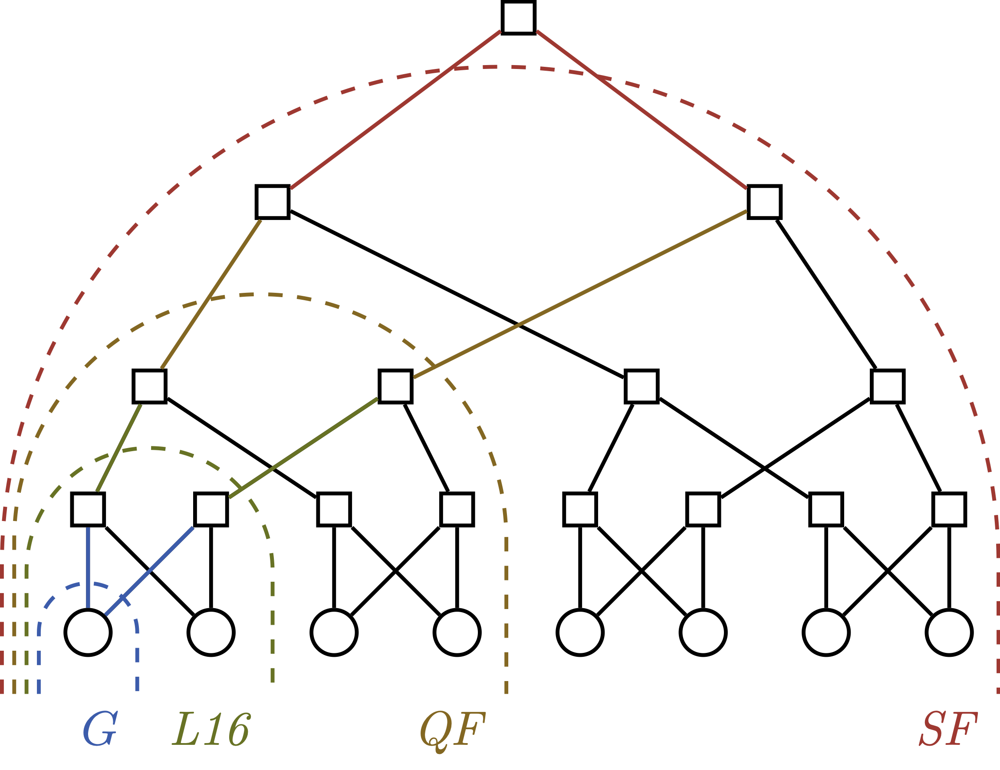
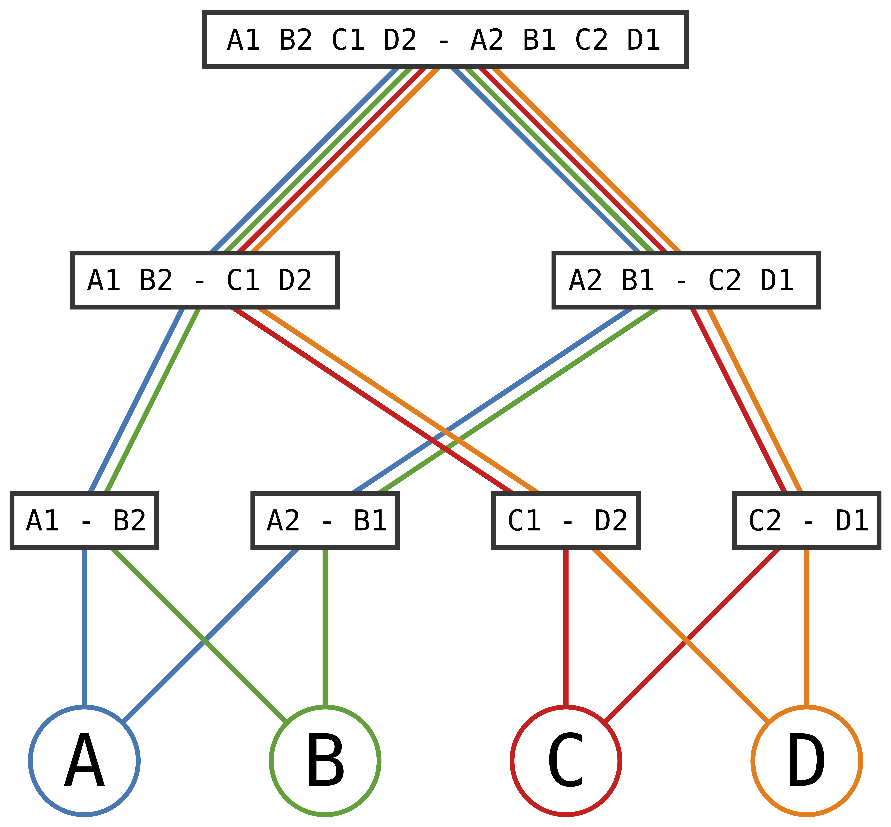

# tournament winning probabilities

The code provides a Python implementation that computes efficiently exact probabilities of an elimination tournament
that follows a round-robin group phase with groups of size 4
where match-outcome probabilities are given.
In the tournaments we consider, fixtures are determined in advance,
i.e., the trajectory of a team is known by the end of the group stage.
The key observation is that whoever advances into the next elimination round (colored edges) is independent
of the other subtrees, and that the same kind of separation of subtrees is maintained upwards:

Match outcomes probabilities

- must not change after the start of the computation
- are independent from each other, i.e., based only on information about the two teams
  playing each other
- distinguish only winning, drawing, and losing, i.e., tie-breaking to determine a ranking at the end of the group
  stage (based on
  goal differences, direct comparisons, fair-play etc.) are not considered and instead treated as fair coin flips

# using the code

There are two main functions which are [_leaveGroup_](https://github.com/gmarmulla/tournament-winning-probabilities/blob/ef998a850dfb6c6946d99dd557a57dca2a40e509/src/group_phase.py#L83)
and [_runExactProbs_](https://github.com/gmarmulla/tournament-winning-probabilities/blob/ef998a850dfb6c6946d99dd557a57dca2a40e509/src/knockout_phase.py#L199).
The first computes the probabilities to leave a group in which a single round-robin tournament is played (so far, this function is only implemented for a group size of four).
The second computes probabilities for all tournament stages.
Each team is assumed to have a constant index in the matrices, 
and the order of the teams is representing the fixture from left to right, 
i.e., the first four teams belong to the leftmost group of the tournament tree, and so on.
The optional argument _mixuntil_ for the knockout phase allows alternative tournament formats where subtrees are merged 
from a certain elimination round onwards.
This applied for example to the Women's World Cup 2023 after elimination round 2:

FIFA Women's World Cup 2023

Exemplarily, the application of the code to the FIFA Men's and Women's World Cup 2022/2023,
as well as the UEFA Women's Euro 2025 can be found in [_run_fmwc22.py_](https://github.com/gmarmulla/efficient-tournament-probabilities/blob/main/src/run_fmwc22.py), [_run_fwwc23.py_](https://github.com/gmarmulla/efficient-tournament-probabilities/blob/main/src/run_fwwc23.py) 
and [_run_uwe25.py_](https://github.com/gmarmulla/efficient-tournament-probabilities/blob/main/src/run_uwe25.py);
we use the match outcome model of Davidson & Beaver (1977) 
where the team strengths are derived from FIFA Ratings.

FIFA Men's World Cup 2022

UEFA Women's Euro 2025

# references

[Brandes, U., Marmulla, G., & Smokovic, I. (2025).
Efficient computation of tournament winning probabilities.
Journal of Sports Analytics, 11. https://doi.org/10.1177/22150218251313905](https://journals.sagepub.com/doi/10.1177/22150218251313905)

[Davidson RR, Beaver RJ (1977).
On extending the Bradley-Terry model to incorporate within-pair order effects.
Biometrics 33(4): 693–702. https://doi.org/10.2307/2529467.](https://www.jstor.org/stable/2529467?origin=crossref&seq=3)

[FIFA/Coca-Cola World Ranking](https://inside.fifa.com/fifa-world-ranking)